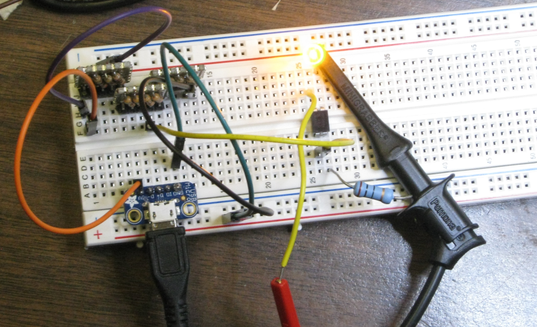
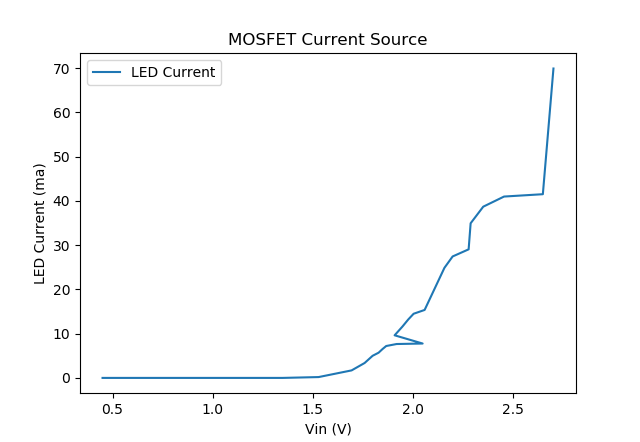
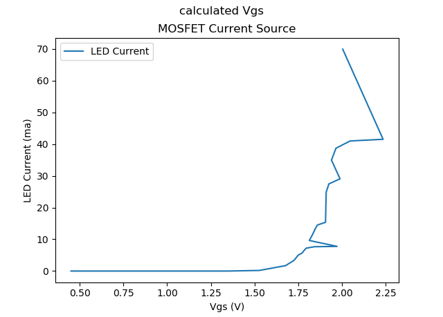

# MOSFET Current Source

Made a current source using a IRLD024 Power MOSFET.

## Data File

Data was taken with a DMM. 

* Vin was measured between the gate and ground.
* Vres was measured across the resistor.
* ILED was calculated by dividing Vres by 10.

## Plot Current vs Vin

There appear to be a couple errant points.

The plot was created using the python script [plot-LED-current.py](plot-LED-current.py).

## Plot Current vs Vgs

There appear to be a couple errant points.

The plot was created using the python script [plot-LED-current-vgs.py](plot-LED-current-vgs.py)
